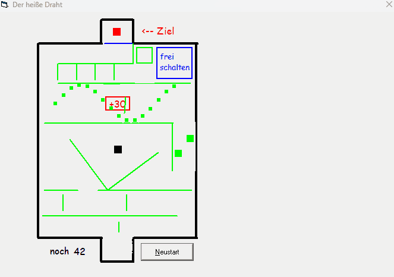
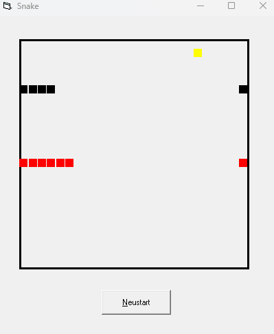
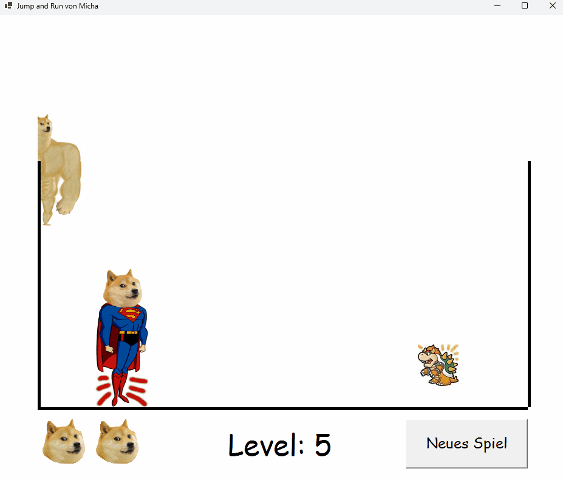
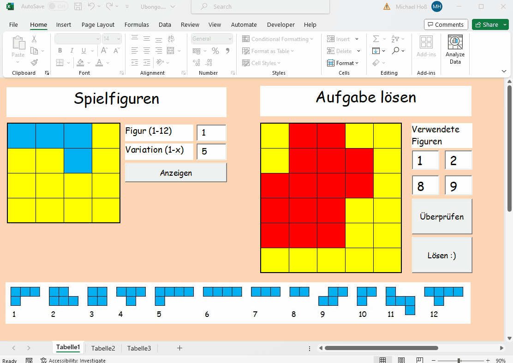
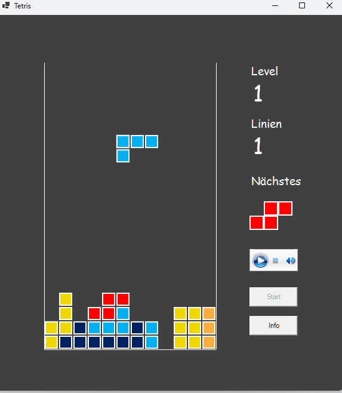
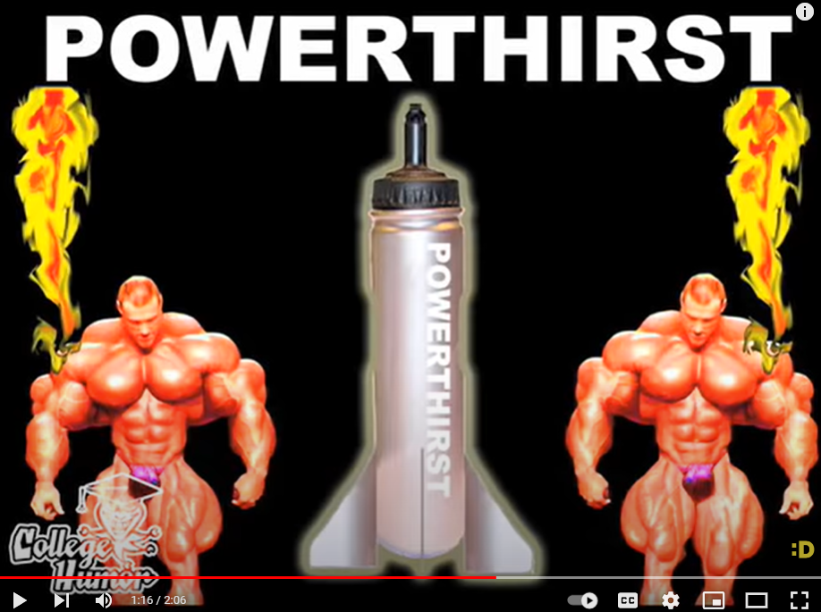
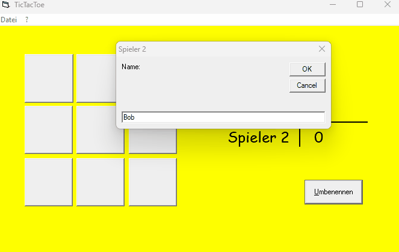

# High School Coding Projects

   

## Play the games yourself
Check out the GitHub releases for Windows `.exe` files, which all run smoothly on my Windows 11 machine. I included:
- the VB 6.0 executables from 2011
- some upgraded VB.NET executables from 2023
- the Excel spreadsheets with VBA that I upgraded to modern 64bit VBA are under `Excel/`

## Background 

In high school, the mandatory C++ never motivated me to code, as the ratio of effort per reward was really bad. 

Luckily, that changed when I did an internship at [SER Group](https://www.sergroup.com/) in 12th grade, where my workplace had nothing but a Visual Basic 6.0 IDE and a tutorial [Visual Basic in 21 Tagen](	https://d-nb.info/954543114). 
When I got bored by the tutorial, my colleague quickly inspired me to instead code whatever idea came to my mind. 

Within the two weeks, I had implemented a backward running clock, Tic Tac Toe, a buzz wire game, and multi-player Snake, with plans to integrate this into another intern's local network chat. 

After that internship, I was on fire and subsequently coded my own version of Tetris, a jump-and-run game for a friend's birthday, and then moved to Excel, where I redid Snake, and where I solved the Ubongo board game at an event of University of Kaiserslautern. 

## Technical stuff around VB 6.0 and VB.NET

I originally developed these projects between 2009 and 2011 in Visual Basic (VB) 6.0 and Excel with VBA 6.0 macros. I decided to publish them in 2023, when the ancient 32 bit 6.0 versions of VB/VBA are no longer supported. Therefore, I upgraded a lot of the code to VB.NET (using the [Mobilize.Net's Visual Basic Upgrade Companion (VBUC)](https://www.mobilize.net/products/app-migrations/vbuc)) to make sure everything still runs on my Windows 11 machine. Ironically, Microsoft also seems to deprecate VB.NET in favor of C#, but VB.NET was still the most straightforward target language to me, as it is closer to VB 6.0 and I won't support this anyway.

Running any code here is at your own risk (with my best intentions, I am pretty sure that nothing bad will happen to your system, though).

The tooling round modernizing VB 6.0 applications also seems to enable migrating these old Desktop applications to the web (both the code upgrade tools and Visual Studio 2022). The most straightforward way would probably be upgrading to C# and then hosting it on Azure. 
However, the effort of dealing with this hasn't yet been worth it for me.

# Individual Games

## Buzz wire (Der heifle Draht)

My very first game! As you might notice, I did it at a time when we did a lot of sine and cosine in school, so here I could finally do something with it. 

Notes:
- In your Windows keyboard settings, *set the key press repetition delay to minimum and repetition rate to maximum*. This will let your figure move faster.
- Hit this red `+30` seconds box, otherwise time is too short. 
- Unlock the goal by going to the `frei schalten` field before.
- In case the free floating bars are at unfavorable positions, reaching the goal is not meant to be (typically, this happens in the first round after starting the program).

## Snake

### Snake single player (VB)
- As the snake grows longer, you might encounter the snake to run slower and the program to lag. This is due to an inefficient `O(n)` implementation of the snake movement that seemed to matter under the tooling I used. Awareness of complexity came later.
- The high score data is stored on your hard disk/SSD under `C:\Snake 2009\`. 

### Snake multi player (VB)

- Use W-A-S-D keys and 8-4-5-6 keys for both players, respectively.
- There are no ties when both heads run into the same empty field at the same time. In doubt, there is one hard-coded player that always wins.

### Snake (Excel)

Together with a friend, I handed this in for a computer science submission that we had to do in Excel with VBA. The grid-like structure of an Excel sheet was perfect to migrate the VB 6.0 Snake there. This time, I could also include the high score into the program itself. 
Notes:
- Unfortunately, no multi player
- Whenever somebody tells me VBA is boring, I tell them they should try doing Snake in Excel first.
- I also wanted to do put Tetris into Excel, but somehow, it never got enough priority for me. 

## Jump and Run

I originally gifted this game as a birthday present to a friend. Since she didn't manage to complete it, I exported a new version with less difficulty. Since also I had no version control at the time, the game is still is this relatively easy mode. 
Notes: 
- You can jump on the walls. 
- In Level 5, you can get an extra life. 
- The end boss can only be defeated with the superpowers of a special NPC. 
- Since I only wanted to publish the anonymized version (using Doge), this project is only availabe in VB.NET.

## Ubongo Board Game Solution

Towards the end of my high school time, I went to "Mathematische Modellierungswoche" with a friend and one of our Maths teachers, which took place in a beatiful village in the middle Rhine valley, and was organized by Felix Klein Zentrum of University of Kaiserslautern. This would probably be called a hackathon or math-athon nowadays. 

I immediately felt drawn towards the [Ubongo](https://en.wikipedia.org/wiki/Ubongo) project because I could apply my prior experience from tetris there. This is basically a fusion of a jigsaw puzzle and tetris. It turned out that in our project team of 6 or 7 students, I was the only person who knew how to code (and the only guy, as the other guys all picked some American football team ranking algorithms or similar). 

The girls ended up inventing heuristics with pen and paper, while I implemented a brute force solution in an awesome 3 day pair programming session with the two supervising computer science teachers. 

## Tetris 

This might have been the game where I put in most effort. The first version of it was a super messy piece of spaghetti code full of goto commands. 

When we had to hand in something self-programmed for our computer science class, I decided to use my tetris implementation, but I was afraid of a bad grade for the terrible code structure. This was when I did my first refactor and documentation (see [here](tetris/DocumentationForHighSchool/Schriftliche%20Ausarbeitung.pdf)). 

### Tetris sounds

I loved the great [Powerthirst 2.0 commercial](https://www.youtube.com/watch?v=t-3qncy5Qfk) and decided to treat the Tetris player with the awesome sounds and visuals from there when they complete lines and levels. 

The more recent VB.NET executable has all effect sounds compiled into it. 

For the old executable from VB6.0, the sound files have the be in the same directory as the executable, otherwise they are not found by the program.
- Effects for the gameplay: `Babies.wav`, `BearBlasting.wav`, `OhLord.wav`, `TopScore.wav`
- Music by the media player on the side: `Musik.wav` ([Official tetris music]( https://www.youtube.com/watch?v=NmCCQxVBfyM)). Not included here here because of copyright issues. You can put your own file there and play it through that player.

## Tic Tac Toe

Only here for completeness (and to try the VB6.0 -> VB.NET upgrade tool with a minimal example).

# General Remarks to the Games

- The graphics are generally flickering because I never used a graphics engine. Instead, I just used picture boxes and changed their X and Y coordinates in a recurring timer function. I guess these picture boxes are not meant to be moved around every couple of milliseconds. 
- I capture the user's keyboard input through a hidden text field. This works based on the characters' ASCII keys and means that all of my games work with W-A-S-D as input keys, rather than arrow keys, which would not have ASCII keys. 
- Even though some code structures, variable scopes, and naming conventions seem strange for me today, the code should still be fairly readable (in German).
